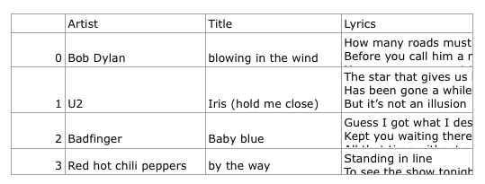
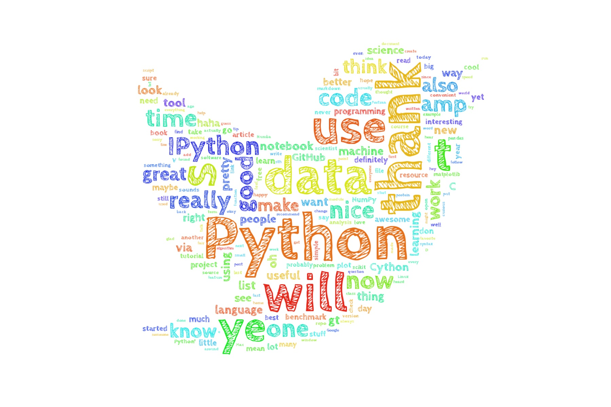
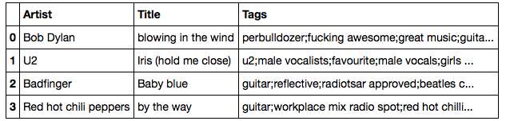
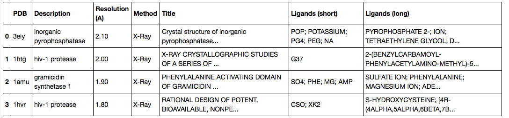
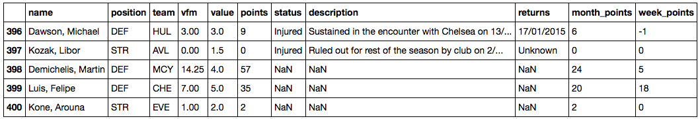

# datacollect

**A collection of tools to collect and download various data.**

Often, I write simple scripts and tools to collect data for various "data science" tasks. I thought that it might be worthwhile to collect them in a central repository since they might be useful to others!

#### Contents
- [Collect Lyrics](./collect_lyrics)
- [Twitter Timeline](./twitter_timeline)
- [Collect Popular Music Tags](./collect_music_tags)
- [PDB Info Table](./pdb_infotable)
- [Collect English Premier League Soccer Data](./collect_fantasysoccer)

 

**Important Note**  
Please note that I developed and tested these tools in Python 3.x, and it could be possible that the scripts do not work flawlessly in Python 2.7.x due to the more challenging unicode handling.

 
 

## [Collect Lyrics](./collect_lyrics)

[[back to top](#contents)]

A [command line tool](./collect_lyrics) to download song lyrics given artist names and song titles. 

 
 

## [Twitter Timeline](./twitter_timeline)
[[back to top](#contents)]

A [command line tool](./twitter_timeline) that downloads your personal twitter timeline in CSV format with optional keyword filter.

[Tutorial](http://nbviewer.ipython.org/github/rasbt/datacollect/blob/master/dataviz/twitter_cloud/twitter_wordcloud.ipynb) for turning your twitter timeline into a word cloud.

 
 

## [Collect Popular Music Tags](./collect_music_tags)
[[back to top](#contents)]

A [command line tool](./collect_music_tags) to download popular tags for a list of songs from [last.fm](http://www.last.fm), e.g., for various data mining projects.

 
 

## [PDB Info Table](./pdb_infotable)
[[back to top](#contents)]

A [command line tool](./pdb_infotable) that creates an info table from a list of PDB files.

 
 

## [Collect English Premier League Soccer Data](./collect_fantasysoccer)
[[back to top](#contents)]

A [command line tool](./collect_fantasysoccer) to Collect Fantasy Soccer data  from the Premier League.

