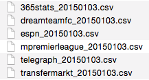

# Fantasy Soccer Data Downloader

Sebastian Raschka, 2014

A simple command line tool to download English Premier League (fantasy) soccer data from the following websites:

- Fantasy football data and player team names:
[https://www.dreamteamfc.com/statistics/players/ALL/](https://www.dreamteamfc.com/statistics/players/ALL/)

- Injury information: [https://www.dreamteamfc.com/statistics/injuries-and-cards/ALL/](https://www.dreamteamfc.com/statistics/injuries-and-cards/ALL/)

- Fantasy-sports based form data: [https://www.dreamteamfc.com/statistics/form-guide/all](https://www.dreamteamfc.com/statistics/form-guide/all)

- Team statistics: [http://www.espnfc.com/barclays-premier-league/23/table](http://www.espnfc.com/barclays-premier-league/23/table)

- Top 50 scorers: [http://www.espnfc.com/barclays-premier-league/23/statistics/scorers](http://www.espnfc.com/barclays-premier-league/23/statistics/scorers)

- Top 50 assists: [http://www.espnfc.com/barclays-premier-league/23/statistics/assists](http://www.espnfc.com/barclays-premier-league/23/statistics/assists)

- Injuries: [http://365stats.com/football/injuries](http://365stats.com/football/injuries)

- Fixtures: [http://www.transfermarkt.com/premier-league/startseite/wettbewerb/GB1](http://www.transfermarkt.com/premier-league/startseite/wettbewerb/GB1)

- Fantasy sports data:  [https://fantasyfootball.telegraph.co.uk/premierleague/players/](https://fantasyfootball.telegraph.co.uk/premierleague/players/), [https://fantasyfootball.telegraph.co.uk/premierleague/formguide/](https://fantasyfootball.telegraph.co.uk/premierleague/formguide/)

- Team ranks: [http://m.premierleague.com/en-gb/form-guide.html](http://m.premierleague.com/en-gb/form-guide.html)

- Predicted lineups: [http://www.fantasyfootballscout.co.uk/team-news/](http://www.fantasyfootballscout.co.uk/team-news/)

 
 

### Sections
- [Overview and Examples](#overview)
- [Requirements](#requirements)
- [Usage](#usage)
- [Changelog](#changelog)

 

### [View the accompanying IPython Notebook](http://nbviewer.ipython.org/github/rasbt/datacollect/blob/master/collect_fantasysoccer/collect_fantasysoccer.ipynb)

 
 
<a id='overview'>
## Overview and Examples
[[back to top](#sections)]
 
 
Running the fantasy soccer data collector from the command line is easy: Just provide a output path for the results, and you are good to go!

**Example:**

	python collect_fantasysoccer.py -o ~/Desktop/soccerdata/

**Output:**

After the script completed, you'll find 5 CSV files with data in the output directory:

**Screen Output: **

<pre>Getting general statistics from dreamteamfc.com ...
Getting team standings from espnfc.com ...
Getting injury data from 365stats.com ...
Getting home/away data from transfermarkt.com ...
Getting player form data from telegraph.co.uk ...
Getting team form data from m.premierleague.com ...
./data/2014_epl_day_21/dreamteamfc_20150103.csv written
./data/2014_epl_day_21/espn_20150103.csv written
./data/2014_epl_day_21/365stats_20150103.csv written
./data/2014_epl_day_21/transfermarkt_20150103.csv written
./data/2014_epl_day_21/telegraph_20150103.csv written
./data/2014_epl_day_21/mpremierleague_20150103.csv written</pre>

 
 
<a id='requirements'>
# Requirements
[[back to top](#sections)]

The `Fantasy Soccer Data Collector` was built and tested in Python 3 and requires the following external Python packages:

- [BeautifulSoup 4](https://pypi.python.org/pypi/beautifulsoup4/4.3.2)
- [html5lib](https://pypi.python.org/pypi/html5lib)
- [requests](https://pypi.python.org/pypi/requests)
- [pandas](http://pandas.pydata.org)

The packages can be downloaded and installed, e.g., via `pip`

	pip install <package_name>

or

	python -m pip install <package_name>

 
 
<a id='usage'>
# Usage
[[back to top](#sections)]

<pre>
python collect_fantasysoccer.py -h
usage: collect_fantasysoccer.py [-h] -o OUTPUT [-v]

A command line tool to download current Premier League (Fantasy) Soccer data.

optional arguments:
  -h, --help            show this help message and exit
  -o OUTPUT, --output OUTPUT
                        Output directory.
  -v, --version         show program's version number and exit

Example:
./collect_fantasysoccer.py -o ~/Desktop/matchday_17</pre>

 
 
<a id='changelog'>
# Changelog
[[back to top](#sections)]

- v1.0.1 (01/03/2015)
	- Added m.premierleague.com to get team form data.
- v1.0 (12/29/2014)