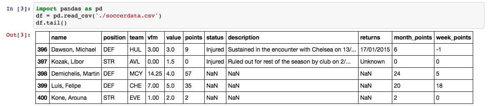

# Fantasy Soccer Data Downloader

Sebastian Raschka, 2014

A simple command line tool to download fantasy soccer data from [https://www.dreamteamfc.com](https://www.dreamteamfc.com) (Premier League).

 

### Sections
- [Overview and Examples](#overview)
- [Requirements](#requirements)
- [Usage](#usage)
- [Changelog](#changelog)

 
 
<a id='overview'>
## Overview and Examples
[[back to top](#sections)]
 
 
Running the fantasy soccer data collector from the command line is easy: Just provide a output path for the results, and you are good to go!

**Example:**

	python collect_fantasysoccer.py -o ~/Desktop/soccerdata.csv

**Output: **

 
 
<a id='requirements'>
# Requirements
[[back to top](#sections)]

The `Fantasy Soccer Data Collector` was built and tested in Python 3 and requires the following external Python packages:

- [BeautifulSoup 4](https://pypi.python.org/pypi/beautifulsoup4/4.3.2)
- [html5lib](https://pypi.python.org/pypi/html5lib)
- [requests](https://pypi.python.org/pypi/requests)
- [pandas](http://pandas.pydata.org)

The packages can be downloaded and installed, e.g., via `pip`

	pip install <package_name>

or

	python -m pip install <package_name>

 
 
<a id='usage'>
# Usage
[[back to top](#sections)]

<pre>
python collect_fantasysoccer.py --help
usage: collect_fantasysoccer.py [-h] -o OUTPUT [-v]

A command line tool to download fantasy soccer statistics from https://www.dreamteamfc.com

optional arguments:
  -h, --help            show this help message and exit
  -o OUTPUT, --output OUTPUT
                        Output CSV file.
  -v, --version         show program's version number and exit

Example:
./collect_fantasysoccer.py -o soccerdata.csv</pre>

 
 
<a id='changelog'>
# Changelog
[[back to top](#sections)]

- v1.0 (12/19/2014)