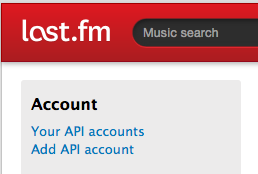

# Music Tag Collector

A simple command line tool to download popular tags for a list of songs from [last.fm](http://www.last.fm), e.g., for various data mining projects.

 

### Sections
- [Overview and Examples](#overview)
- [Requirements](#requirements)
- [Usage](#usage)
- [Changelog](#changelog)

 
 
<a id='overview'>
## Overview and Examples
[[back to top](#sections)]
 
 

`collect_music_tags.py` reads in a list of `artists` and `titles` from a CSV file that should be formatted as follows:

	Artist,Title
	Bob Dylan,blowing in the wind
	U2,Iris (hold me close)
	Badfinger,Baby blue
	Red hot chili peppers,by the way

A progress bar ([`pyprind`](https://github.com/rasbt/pyprind)) will show the progress during the download process. 

	> ./collect_music_tags.py -i ./examples/artist_title.csv -o out.csv
	0%  100%
	[####] | ETA[sec]: 0.000
	Total time elapsed: 2.230 sec

And the output CSV file will look as follows (here shown as screenshot using a spread sheet application):

 
 
<a id='requirements'>
# Requirements
[[back to top](#sections)]

### Python libraries

The `collect_music_tags.py` was built and tested in Python 3 and requires the following external Python packages:

- [pandas](http://pandas.pydata.org)
- [pyprind](https://github.com/rasbt/pyprind)
- [pylast](https://pypi.python.org/pypi/pylast/)

The packages can be downloaded and installed, e.g., via `pip`

	pip install <package_name>

or

	python -m pip install <package_name>

 

### API key

In order to use `collect_music_tags.py`, you also need up to sign-up for [last.fm and acquire an API-key](http://www.last.fm/api/account/create); don't worry, this shouldn't take more than 60 seconds.

Next, you need to enter the 

- the API Key
- the API Secret key
- your last.fm username
- your last.fm password

Into the placeholder [`user_auth.py`](./user_auth.py) which should be located in your current directory if you run `collect_music_tags.py`.

**PLEASE REMEMBER TO KEEP THE `user_auth.py` FILE PRIVATE!**

 
 
<a id='usage'>
# Usage
[[back to top](#sections)]

<pre>
./collect_music_tags.py -h
usage: collect_music_tags.py [-h] [-i INPUT] [-o OUTPUT] [-v]

A command line app for downloading popular song tags from last.fm

optional arguments:
  -h, --help            show this help message and exit
  -i INPUT, --input INPUT
                        Input CSV file.
  -o OUTPUT, --output OUTPUT
                        Output CSV file.
  -v, --version         show program's version number and exit

Example:
./collect_music_tags.py -i ./artist_title.csv -o ./out.csv

CSV input format:

Artist,Title
Bob Dylan,blowing in the wind
[...]
</pre>

 
 
<a id='changelog'>
# Changelog
[[back to top](#sections)]

- v1.0 (10/28/2014)